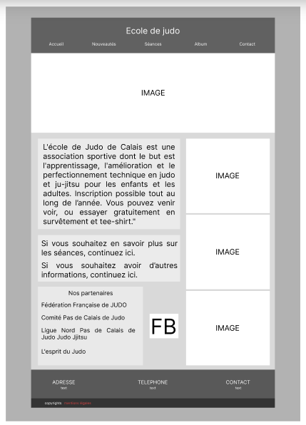
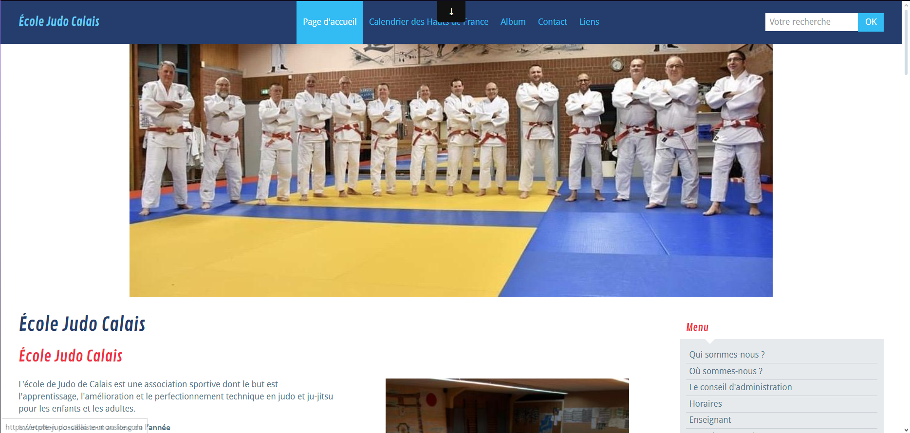
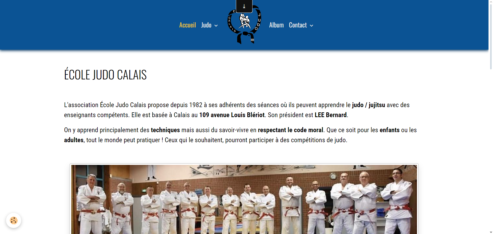

# **Présentation du site web réalisé lors du stage de 2ème année BUT Informatique.**

## 1. Récupération d'information :   

La récupération d'information a commencer par récupérer les informations déjà présente sur le site web déjà existant. J'ai ensuite regarder se que je pouvais rajouter, modifier ou retirer se qui n'était plus d'actualité ou utile de garder. 
Dans cette partie de travail réalisé, j'ai également du récupéré des photos, ainsi que d'en prendre de nouvelles pour ajouter de la nouveautés tout en gardant celle déjà existantes.

## 2. Réalisation de maquette :  

La réalisation de la maquette s'est fait sur Figma, l'outil en ligne pour pré visualisé comment le site web pourra réaliser. 
Voici un screenshot d'une des pages réaliser sur figma. 

Même si le site web final n'a pas fini par ressembler a la maquette, sans elle, je n'aurais pas su comment organiser et améliorer au mieux le site.

## 3. Réalisation du site web :  

Pour la réalisation du site web, j'ai utiliser un hebergeur en ligne pour m'aider a gagner du temps afin de me consacrer le plus possible a la finalisation du site web. Le site web possède une page d'accueil, un onglet JUDO qui regroupe tout se qui conserne le sport en lui même, un album photo et un onglet contact qui permet de savoir comment prendre contact avec l'association.

Voici un comparatif de l'ancien site web.

Et maintenant un screenshot du nouveau site web.

[Accès au site web !](https://ecole-de-judo-de-calais.e-monsite.com)

